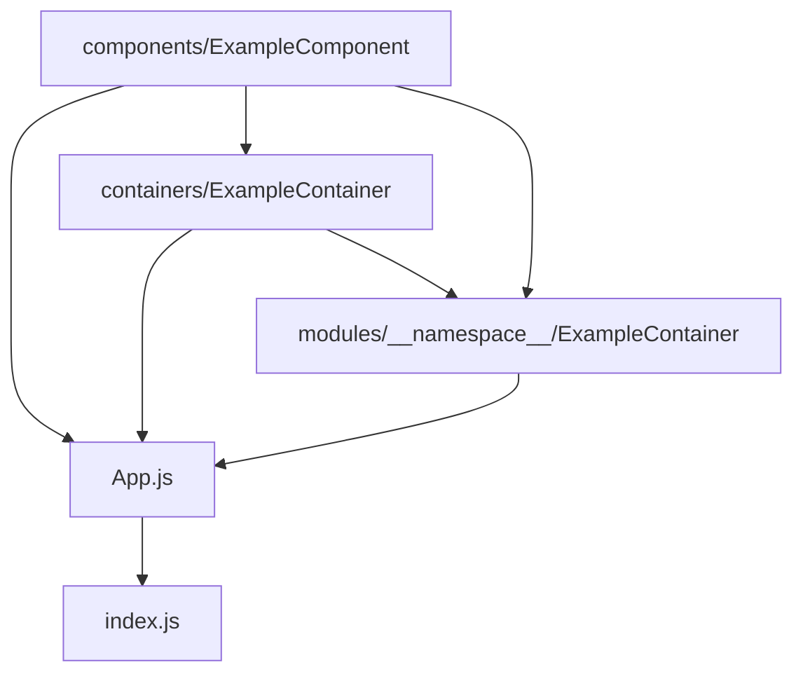

This app was bootstrapped with [Create React App](https://github.com/facebook/create-react-app).

# speira-base-react

## Description

This Skeletton is a module oriented conception. It can be used as skeletton for new React JS App.

- All bundles (modules) are isolated. They provide their containers to the src/App.js file.
- Modules are allowed to communicate each other only by using contexts (src/contexts).
- Modules use the same utilities (src/utils) containing commons functions and constants, they also share the same customs hooks (src/hooks).



## Setup

1- First you have to clone this project:

```bash
git clone https://github.com/Speira/base-react-sample.git
```

2- Create your project with create-react-app:

```bash
 create-react-app [projectName]
 cd [projectName]
```

3- Copy the structure:

```bash
 cp ../base-react-sample/{.babelrc,.editorconfig,.eslintignore,.eslintrc.js,.gitignore,.prettierrc,jsconfig.json,styleguide.config.js} . && cp -r ../base-react-sample/src/{App.js,README.md,components,contexts,hooks,index.css,modules,utils} ./src
```

4- Install the added modules (see the "Added modules" section).

Needed packages:

```bash
yarn add babel-plugin-module-resolver normalize.css prop-types react-router-dom styled-components react-is @styled-icons/bootstrap query-string
```

Development packages:

```bash
yarn add -D babel-plugin-styled-components prettier eslint-config-airbnb eslint-config-prettier eslint-import-resolver-babel-module eslint-plugin-import eslint-plugin-prettier react-styleguidist enzyme enzyme-adapter-react-16
```
The package normalize.css should be included in your src.index.js
```js
// src/index.js
import 'normalize.css';
```
5- Update your package.json

NB: You will have to remove the following sections from your package.json: 
 * eslintConfig
 * babel
 
And then add this to your jest config part in package.json (to sync the babel module resolver config with jest)
```
"jest": {
...
    "moduleNameMapper": {
      "^~(.+)Module(.*)$": "<rootDir>/src/modules/$1Module$2",
      "^~(.+)$": "<rootDir>/src/$1"
    },
}
```

You should also update your srcipt section as below:

```
"scripts":{
    "build": "node scripts/build.js",
    "clean-cache": "rimraf -rf ./node_modules/.cache",
    "lint": "NODE_ENV=development eslint src",
    "start": "yarn clean-cache && yarn lint && node scripts/start.js",
    "styleguide": "styleguidist server",
    "styleguide:build": "styleguidist build",
    "test": "node scripts/test.js --env=jsdom"
    }

```
6- Setup your test:

Your src/setupTests.js must include the enzyme adapter:
```js
...
import Adapter from 'enzyme-adapter-react-16'
import { configure } from 'enzyme'

configure({ adapter: new Adapter() })
```

Your src/App.test.js should look like as follow: 

```js
import React from 'react'
import { shallow } from 'enzyme'
import App from './App'

describe('render', () => {
  const wrapper = shallow(<App />)

  it('App should be defined', () => {
    expect(wrapper).toBeDefined()
  })
  it('App must have Contexts wrapper', () => {
    expect(wrapper.find('Contexts')).toHaveLength(1)
  })
  it('App must have a single ErrorContainer ', () => {
    expect(wrapper.find('ErrorContainer')).toHaveLength(1)
  })
})
```

You can autoformat all the files inside the src folder (according to your prettierrc file) with this command:

```bash
yarn prettier --write src
```

NB: You should add the cross-env library if you want to compile in Windows OS

## Launch

For the styleguide (listening to the port 6060):

```bash
yarn styleguide
```

For the application (port 3000):

```
yarn start
```

For the unit tests:

```
yarn test
```
