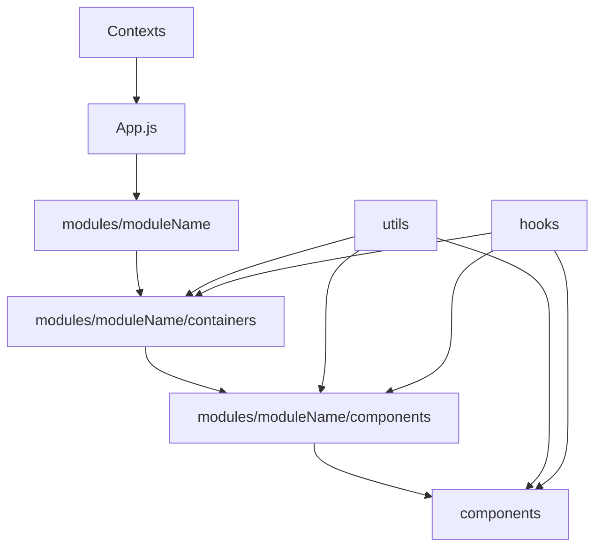

This app was bootstrapped with [Create React App](https://github.com/facebook/create-react-app).

# speira-base-react

## Description

This Skeletton is a module oriented conception. It can be used as skeletton for new React JS App.
- All bundles (modules) are isolated. They provide their containers to the src/App.js file.
- Modules use the same view components (src/components) prepared and customized in their own components (src/modules/[moduleNAme]/components) in order to be used in their containers (src/modules/[moduleNAme]/containers).
- Modules are allowed to communicate each other only by using contexts (src/contexts).
- Modules use the same utilities (src/utils) containing commons functions and constants, they also share the same customs hooks (src/hooks).




## Setup

1- First you have to clone this project:

```bash
git clone https://github.com/Speira/base-react-sample.git
```

2- Create your project with create-react-app:

```bash
 create-react-app [projectName]
 cd [projectName]
```
3- Copy the structure:

```bash
 cp base-react-sample/{.babelrc,.editorconfig,.eslintignore,.eslintrc.js,.gitignore,.prettierrc,jsonconfig.json} .
 cp -r base-react-sample/src/{App.js,AppRoute.js,components,contexts,hooks,index.css,modules,utils} ./src
```

```bash
 cd ./projectName && yarn
```

4- Install the added modules (see the "Added modules" section).

Needed packages:
```bash
yarn add babel-plugin-module-resolver normalize.css prop-types react-router-dom styled-components react-is @styled-icons/bootstrap query-string
```

Development packages:

```bash
yarn add -D babel-plugin-styled-components prettier eslint-config-airbnb eslint-config-prettier eslint-import-resolver-babel-module eslint-plugin-import eslint-plugin-prettier react-styleguidist enzyme enzyme-adapter-react-16
```

## Launch

For the styleguide (listening to the port 6060):

```bash
yarn styleguide
```

For the application (port 3000):

```
yarn start
```

For the unit tests:

```
yarn test
```
